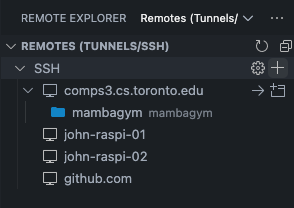
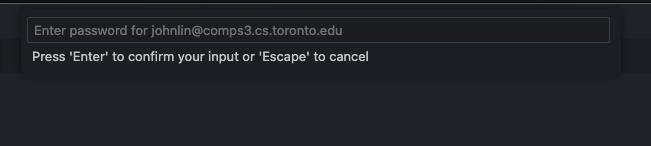

# Remote development with SSH on Visual Studio Code

This is the recommended way to develop for this project, for the following reasons:

- Access to high-performance compute including access to `cuda`-enabled Nvidia GPUs.
- Access to `slurm`

However, it is not without drawbacks, which include:

- A requirement to install a `conda` environment locally, which requires additional work and **LOTS** of space, given the `nvidia-cuda` packages.
- Inability to maintain consistent developer environments

## Setup

### 0. Destinations

In the `comps[0-3].cs.toronto.edu` servers, you may not have enough space to install `conda` _and_ the required packages for this project in your home directory. You can install `conda` in your home directory, but you will have to set a special prefix to install the `mambagym` environment in a `/w/` directory with more space.

These directories should be available:

- `/w/246`
- `/w/247`
- `/w/284`
- `/w/331`
- `/w/339`
- `/w/340`
- `/w/383`

For this example, let's say we'll use the directory `/w/383/<your-cs-toronto-username>`.

### 1. Install `miniforge` for `conda`

Here we'll use the [`miniforge`](https://github.com/conda-forge/miniforge) installation. `miniforge` is a minimal instance of `Anaconda`, with the default channel being `conda-forge`. Additionally, `mamba`, the faster dependency resolver for `conda`, touted as a drop-in replacement, has been deprecated since the resolver has been integrated into `miniconda` and `miniforge` directly since [Release 23.10.0](https://docs.conda.io/projects/conda/en/latest/release-notes.html#with-this-23-10-0-release-we-are-changing-the-default-solver-of-conda-to-conda-libmamba-solver) [[Ref.](https://conda-forge.org/news/2024/07/29/sunsetting-mambaforge/)].

If `conda` is not installed yet, you can install the `miniforge3` version in your home directory.

```bash
curl -L -O "https://github.com/conda-forge/miniforge/releases/latest/download/Miniforge3-$(uname)-$(uname -m).sh"
bash Miniforge3-$(uname)-$(uname -m).sh
```

It shouldn't matter the location of your `miniforge3` installation since in the setup script `conda_setup.sh`, we will be creating a `pkgs_dirs` and `env_dirs` in our target directory, hopefully with much more available space.

### 2. Clone `mambagym` into your target directory

`cd` into your target directory, in our example `/w/383/<your-cs-toronto-username>`, and clone this repo.

```bash
git clone git@github.com:john-s-lin/mambagym.git
```

### 3. Run `conda_setup.sh` in `slurm` to create a new `conda` environment with `cuda` enabled

In the root of your `mambagym` repo, edit `conda_setup.sh` to set your `TARGET_DIR_PREFIX` to your current repo.

```bash
# conda_setup.sh

# /w/383 can be any one of the directories above in 0. Destinations
TARGET_DIR_PREFIX="/w/383/${USER}"
```

Once your `TARGET_DIR_PREFIX` is set, you can run `conda_setup.sh` with `slurm` using `sbatch`.

```bash
sbatch conda_setup.sh
```

It should return a `job-id`, which you can monitor progress for in the `/logs` directory, looking at `<job-id>.log` for logs or `<job-id>.err` for errors.

> **NOTE**: the installation of the various packages for your conda environment will take up to 30 minutes, depending on circumstances.

### 4. Use `VSCode` to access your remote development environment

In VSCode, make sure you have the `Remote - SSH (id.: ms-vscode-remote.remote-ssh)` and `Remote Explorer (id.: ms-vscode.remote-explorer)` extensions enabled.

Then in the sidebar, click on the `Remote Explorer` tab and ensure the dropdown menu at the top refers to `Remotes (Tunnels/SSH)`.


Next to the `SSH` header, click on the `+` sign to add a new remote destination.



At the top search bar on `VSCode` you will see a pop-up command to enter an SSH tunnel


Enter an SSH command to a `comps[0-3].cs.toronto.edu` server with your `cs.toronto.edu` username.

```bash
ssh <your-cs-toronto-username>@comps0.cs.toronto.edu
```

Then connect to your `SSH` tunnel in a new window.


At the top of the new `VSCode` window, you will be prompted to enter your password.


Congrats! Now you are connected to a remote instance of `VSCode` running on a remote server.

In the new window, click `Open` to open a prompt to go to your target directory, in this case, `/w/383/<your-cs-toronto-username>/mambagym`, where `/w/383` can be any of the directories listed in [0. Destinations](#0-destinations) above.


Enter the absolute location of your target directory.


Click `OK`, then you will be prompted with your password once again.



Once complete, you should have direct access to the target directory for next time in your `Remote Explorer` sidebar.


## Running HPC programs on `slurm`

By now, it should be easy for you to run your ML scripts with `slurm`. The easiest and most-reproducible way is to create a `bash` script in the root directory of this repository, activate your `conda` environment, either within the script or outside of it, then run `sbatch your-script.sh`. For more information, refer to [`docs/slurm.md`](./slurm.md).
